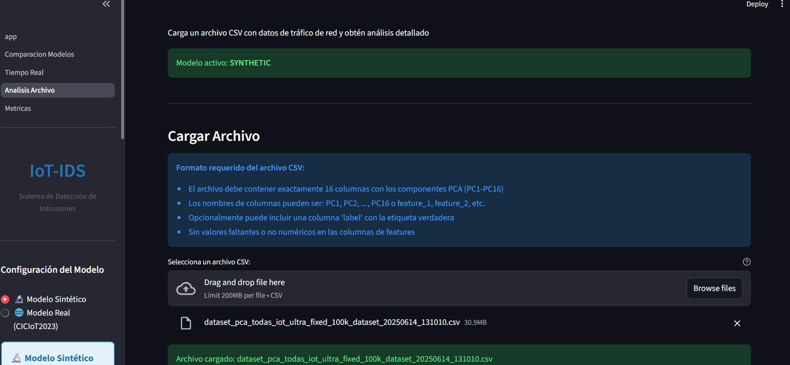

# Guía de Capturas Visuales - Dashboard IoT-IDS

Esta guía proporciona instrucciones detalladas para capturar screenshots y crear GIFs de demostración del sistema.

## Índice

1. [Screenshots Requeridos](#screenshots-requeridos)
2. [Herramientas Recomendadas](#herramientas-recomendadas)
3. [Guía de Screenshots](#guía-de-screenshots)
4. [Creación de GIFs](#creación-de-gifs)
5. [Optimización de Imágenes](#optimización-de-imágenes)
6. [Ubicación de Archivos](#ubicación-de-archivos)

---

## Screenshots Requeridos

### Lista de Capturas Esenciales

```
screenshots/
├── 01_pagina_principal.png          [Página principal con sidebar]
├── 02_comparacion_modelos.png       [Página de comparación]
├── 03_comparacion_resultados.png    [Tabla de comparación con resultados]
├── 04_tiempo_real.png               [Simulación en tiempo real]
├── 05_tiempo_real_graficos.png      [Gráficos temporales]
├── 06_analisis_archivo.png          [Carga de archivo CSV]
├── 07_analisis_resultados.png       [Resultados del análisis]
├── 08_metricas_overview.png         [Vista general de métricas]
├── 09_metricas_confusion.png        [Matriz de confusión]
└── 10_metricas_comparacion.png      [Comparación entre modelos]
```

---

## Herramientas Recomendadas

### Para Screenshots (Imágenes Estáticas)

#### Windows
- **Snipping Tool / Snip & Sketch** (Nativo)
  - Atajos: `Win + Shift + S`
  - Ventajas: Gratis, simple, integrado
  - Formato: PNG

- **ShareX** (Recomendado)
  - URL: https://getsharex.com/
  - Ventajas: Gratis, anotaciones, upload automático
  - Formato: PNG, JPG

- **Greenshot**
  - URL: https://getgreenshot.org/
  - Ventajas: Gratis, open source, anotaciones
  - Formato: PNG, JPG

#### Linux
- **Flameshot** (Recomendado)
  ```bash
  sudo apt install flameshot
  ```
  - Atajo: `flameshot gui`
  - Ventajas: Anotaciones, blur, arrows

- **GNOME Screenshot**
  - Atajo: `Shift + PrintScreen`

#### macOS
- **Screenshot** (Nativo)
  - Atajos:
    - `Cmd + Shift + 3`: Pantalla completa
    - `Cmd + Shift + 4`: Selección
    - `Cmd + Shift + 5`: Opciones avanzadas

### Para GIFs (Animaciones)

#### Windows
- **ScreenToGif** (Recomendado)
  - URL: https://www.screentogif.com/
  - Ventajas: Gratis, editor integrado, optimización
  - Formato: GIF, MP4, APNG

- **LICEcap**
  - URL: https://www.cockos.com/licecap/
  - Ventajas: Ligero, simple
  - Formato: GIF, LCF

#### Linux
- **Peek** (Recomendado)
  ```bash
  sudo apt install peek
  ```
  - Ventajas: Simple, optimizado
  - Formato: GIF, MP4, WebM

- **Byzanz**
  ```bash
  sudo apt install byzanz
  ```

#### macOS
- **Kap** (Recomendado)
  - URL: https://getkap.co/
  - Ventajas: Gratis, open source, plugins
  - Formato: GIF, MP4, WebM

#### Multiplataforma
- **OBS Studio**
  - URL: https://obsproject.com/
  - Para videos (convertir a GIF después)

---

## Guía de Screenshots

### Preparación del Sistema

1. **Limpiar el Entorno**
   ```bash
   # Cerrar aplicaciones innecesarias
   # Ocultar barras de herramientas personales
   # Usar modo incógnito del navegador (si aplica)
   ```

2. **Configurar Resolución**
   - Resolución recomendada: 1920×1080 (Full HD)
   - Zoom del navegador: 100%
   - Sidebar colapsado o expandido (consistente)

3. **Iniciar Aplicación**
   ```bash
   cd Dashboard-IoT-IDS
   streamlit run app.py
   ```

### Capturas Paso a Paso

#### Screenshot 1: Página Principal

**Archivo**: `01_pagina_principal.png`

**Pasos**:
1. Abrir `http://localhost:8501`
2. Esperar a que cargue completamente
3. Asegurar que el sidebar esté visible
4. Verificar que se muestre:
   - Título del dashboard
   - Selección de modelo
   - Arquitectura del modelo
   - Métricas principales
5. Capturar pantalla completa del navegador

**Elementos a incluir**:
- Header principal
- Sidebar con selector de modelo
- Diagrama de arquitectura
- Métricas del modelo activo

---

#### Screenshot 2: Comparación de Modelos

**Archivo**: `02_comparacion_modelos.png`

**Pasos**:
1. Navegar a "Comparación de Modelos" desde sidebar
2. Asegurar que ambos modelos están cargados
3. Verificar que se muestren las opciones:
   - Número de muestras
   - Filtro por tipo de amenaza
4. Capturar antes de generar predicciones

**Elementos a incluir**:
- Título de la página
- Controles de configuración
- Estado de carga de modelos

---

#### Screenshot 3: Resultados de Comparación

**Archivo**: `03_comparacion_resultados.png`

**Pasos**:
1. En página "Comparación de Modelos"
2. Generar predicciones con:
   - 20 muestras
   - Filtro: "Todas las amenazas"
3. Hacer scroll para mostrar:
   - Tabla de resultados
   - Tasa de concordancia
   - Métricas de comparación
4. Capturar tabla completa

**Elementos a incluir**:
- Tabla con predicciones de ambos modelos
- Indicadores de concordancia (SI/NO)
- Nivel de confianza
- Métricas de concordancia

---

#### Screenshot 4: Tiempo Real - Inicio

**Archivo**: `04_tiempo_real.png`

**Pasos**:
1. Navegar a "Tiempo Real"
2. Seleccionar escenario: "Bajo Ataque (DDoS)"
3. Configurar:
   - Muestras por lote: 10
   - Intervalo: 2 segundos
4. Capturar ANTES de iniciar simulación

**Elementos a incluir**:
- Título de la página
- Selector de escenario
- Controles de configuración
- Botón "Iniciar Simulación"

---

#### Screenshot 5: Tiempo Real - Gráficos

**Archivo**: `05_tiempo_real_graficos.png`

**Pasos**:
1. En página "Tiempo Real"
2. Iniciar simulación
3. Esperar ~20 segundos (10 lotes)
4. Capturar cuando el gráfico muestre datos interesantes

**Elementos a incluir**:
- Gráfico temporal de detecciones
- Métricas en vivo (total muestras, amenazas)
- Nivel de riesgo global
- Indicador de última detección

---

#### Screenshot 6: Análisis de Archivo - Upload

**Archivo**: `06_analisis_archivo.png`

**Pasos**:
1. Navegar a "Análisis de Archivo"
2. Mostrar área de upload
3. Capturar instrucciones y formato requerido

**Elementos a incluir**:
- Título de la página
- Área de drag & drop
- Instrucciones de formato CSV
- Ejemplo de estructura de datos

---

#### Screenshot 7: Análisis de Archivo - Resultados

**Archivo**: `07_analisis_resultados.png`

**Pasos**:
1. En página "Análisis de Archivo"
2. Cargar archivo CSV de ejemplo (crear uno si no existe)
3. Esperar procesamiento
4. Capturar resultados:
   - Tabla de predicciones
   - Distribución de amenazas
   - Métricas

**Elementos a incluir**:
- Tabla de resultados
- Gráfico de distribución
- Estadísticas de análisis
- Botones de exportación

---

#### Screenshot 8: Métricas - Overview

**Archivo**: `08_metricas_overview.png`

**Pasos**:
1. Navegar a "Métricas"
2. Seleccionar modelo: "Sintético"
3. Capturar sección superior con:
   - Estadísticas del dataset
   - Métricas de rendimiento
   - Gráfico de historial

**Elementos a incluir**:
- Cards con métricas principales
- Gráficos de accuracy y loss
- Información del dataset

---

#### Screenshot 9: Métricas - Matriz de Confusión

**Archivo**: `09_metricas_confusion.png`

**Pasos**:
1. En página "Métricas"
2. Hacer scroll hasta matriz de confusión
3. Asegurar que se vea completa
4. Capturar con escala de colores visible

**Elementos a incluir**:
- Matriz de confusión completa
- Labels de clases
- Escala de colores
- Título y leyenda

---

#### Screenshot 10: Métricas - Comparación

**Archivo**: `10_metricas_comparacion.png`

**Pasos**:
1. En página "Métricas"
2. Hacer scroll hasta sección de comparación
3. Capturar tabla comparativa de modelos

**Elementos a incluir**:
- Tabla con métricas de ambos modelos
- Gráficos comparativos
- Análisis de diferencias

---

## Creación de GIFs

### GIF 1: Comparación de Modelos (Demo Completa)

**Archivo**: `demo_comparacion.gif`

**Duración**: 15-20 segundos

**Script de grabación**:
```
[Segundo 0-2]   Mostrar página "Comparación de Modelos"
[Segundo 2-4]   Ajustar configuración (20 muestras, filtro "Todas")
[Segundo 4-5]   Click en "Generar Predicciones"
[Segundo 5-8]   Loading animation
[Segundo 8-12]  Scroll por tabla de resultados
[Segundo 12-15] Destacar tasa de concordancia
[Segundo 15-20] Scroll hasta métricas finales
```

**Pasos**:
1. Abrir ScreenToGif/Peek/Kap
2. Seleccionar área de captura (ventana del navegador)
3. FPS recomendado: 15-20
4. Iniciar grabación
5. Seguir script
6. Detener grabación
7. Editar:
   - Remover frames innecesarios
   - Ajustar velocidad si es necesario
   - Agregar delay al final (2s)

---

### GIF 2: Simulación en Tiempo Real

**Archivo**: `demo_tiempo_real.gif`

**Duración**: 20-25 segundos

**Script de grabación**:
```
[Segundo 0-3]   Mostrar página "Tiempo Real"
[Segundo 3-5]   Seleccionar escenario "Bajo Ataque"
[Segundo 5-6]   Click en "Iniciar Simulación"
[Segundo 6-20]  Mostrar gráfico actualizándose en tiempo real
[Segundo 20-22] Mostrar métricas finales
[Segundo 22-25] Detener simulación
```

**Pasos**:
1. Configurar herramienta de captura
2. FPS: 15-20
3. Seguir script
4. Editar:
   - Acelerar secciones monótonas (2x speed)
   - Destacar momentos clave
   - Loop al final

---

### GIF 3: Análisis de Archivo

**Archivo**: `demo_analisis.gif`

**Duración**: 15-20 segundos

**Script de grabación**:
```
[Segundo 0-2]   Mostrar página "Análisis de Archivo"
[Segundo 2-4]   Drag & drop archivo CSV
[Segundo 4-7]   Procesamiento (loading)
[Segundo 7-12]  Mostrar tabla de resultados
[Segundo 12-15] Scroll a gráfico de distribución
[Segundo 15-18] Mostrar botones de exportación
[Segundo 18-20] Hover sobre botón "Descargar PDF"
```

---

### GIF 4: Navegación General

**Archivo**: `demo_navegacion.gif`

**Duración**: 20-25 segundos

**Script de grabación**:
```
[Segundo 0-3]   Página principal
[Segundo 3-5]   Click en sidebar → "Comparación"
[Segundo 5-8]   Mostrar página brevemente
[Segundo 8-10]  Click en sidebar → "Tiempo Real"
[Segundo 10-13] Mostrar página brevemente
[Segundo 13-15] Click en sidebar → "Análisis"
[Segundo 15-18] Mostrar página brevemente
[Segundo 18-20] Click en sidebar → "Métricas"
[Segundo 20-25] Mostrar página brevemente
```

---

## Optimización de Imágenes

### Screenshots (PNG)

**Herramientas**:
- **TinyPNG**: https://tinypng.com/ (web)
- **ImageOptim** (macOS): https://imageoptim.com/
- **OptiPNG** (CLI):
  ```bash
  optipng -o7 screenshot.png
  ```

**Objetivos**:
- Tamaño objetivo: < 500 KB por imagen
- Resolución: 1920×1080 o 1280×720
- Formato: PNG-8 si es posible (menos colores)

### GIFs

**Optimización con Gifsicle**:
```bash
# Instalar gifsicle
# Windows: scoop install gifsicle
# Linux: sudo apt install gifsicle
# macOS: brew install gifsicle

# Optimizar GIF
gifsicle -O3 --colors 256 input.gif -o output.gif

# Reducir colores (mayor compresión)
gifsicle -O3 --colors 128 input.gif -o output.gif

# Reducir tamaño físico
gifsicle --resize-width 1280 input.gif -o output.gif
```

**Objetivos**:
- Tamaño objetivo: < 5 MB por GIF
- Resolución: 1280×720 (720p)
- FPS: 15-20
- Colores: 128-256

**Herramientas Online**:
- **ezgif.com**: https://ezgif.com/optimize
- **gifcompressor.com**: https://gifcompressor.com/

---

## Ubicación de Archivos

### Estructura Recomendada

```
Dashboard-IoT-IDS/
├── docs/
│   └── screenshots/
│       ├── 01_pagina_principal.png
│       ├── 02_comparacion_modelos.png
│       ├── 03_comparacion_resultados.png
│       ├── 04_tiempo_real.png
│       ├── 05_tiempo_real_graficos.png
│       ├── 06_analisis_archivo.png
│       ├── 07_analisis_resultados.png
│       ├── 08_metricas_overview.png
│       ├── 09_metricas_confusion.png
│       └── 10_metricas_comparacion.png
│
├── docs/
│   └── gifs/
│       ├── demo_comparacion.gif
│       ├── demo_tiempo_real.gif
│       ├── demo_analisis.gif
│       └── demo_navegacion.gif
│
└── README.md  (incluir imágenes aquí)
```

### Actualizar README.md

Agregar sección de screenshots al final del README:

```markdown
## Screenshots

### Página Principal


### Comparación de Modelos


### Simulación en Tiempo Real


### Análisis de Archivo



### Métricas del Sistema


## Demos en GIF

### Comparación de Modelos


### Simulación en Tiempo Real


### Análisis de Archivos

```

---

## Consejos Generales

### Para Screenshots

1. **Consistencia**:
   - Usar siempre la misma resolución
   - Mantener mismo nivel de zoom
   - Mismo tema de OS (claro/oscuro)

2. **Contenido**:
   - Evitar información personal
   - Usar datos de ejemplo representativos
   - Mostrar estados "interesantes" (no vacíos)

3. **Calidad**:
   - PNG para screenshots (mejor calidad)
   - Evitar compresión JPEG
   - Capturar en resolución nativa

### Para GIFs

1. **Duración**:
   - Máximo 30 segundos
   - Mínimo 10 segundos
   - Loop infinito

2. **Velocidad**:
   - Mostrar acciones a velocidad real
   - Acelerar secciones de loading (2x)
   - Pausar al inicio y final (2s)

3. **Tamaño**:
   - Reducir colores (128-256)
   - Reducir FPS (15-20)
   - Reducir resolución si es necesario

---

## Checklist Final

Antes de publicar:

- [ ] Todos los screenshots capturados (10 imágenes)
- [ ] Todos los GIFs creados (4 animaciones)
- [ ] Imágenes optimizadas (< 500 KB cada screenshot)
- [ ] GIFs optimizados (< 5 MB cada uno)
- [ ] Carpeta `docs/screenshots/` creada
- [ ] Carpeta `docs/gifs/` creada
- [ ] README.md actualizado con imágenes
- [ ] Imágenes suben correctamente a GitHub
- [ ] GIFs se reproducen correctamente en GitHub

---

## Recursos Adicionales

### Tutoriales

- **ScreenToGif Tutorial**: https://www.screentogif.com/wiki
- **Peek Usage**: https://github.com/phw/peek
- **Gifsicle Documentation**: https://www.lcdf.org/gifsicle/man.html

### Herramientas Alternativas

- **Asciinema** (para terminal): https://asciinema.org/
- **Loom** (video con narración): https://www.loom.com/
- **CloudApp** (screenshots + GIFs): https://www.getcloudapp.com/

---

**Nota**: Estas capturas son para documentación y demostración. Asegurar que no incluyan información sensible o personal.
